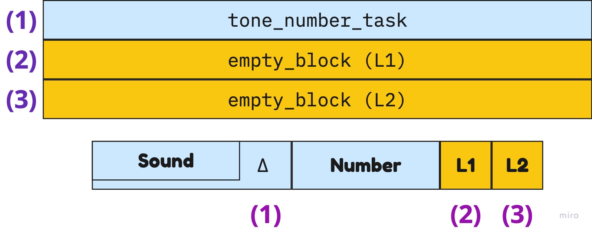
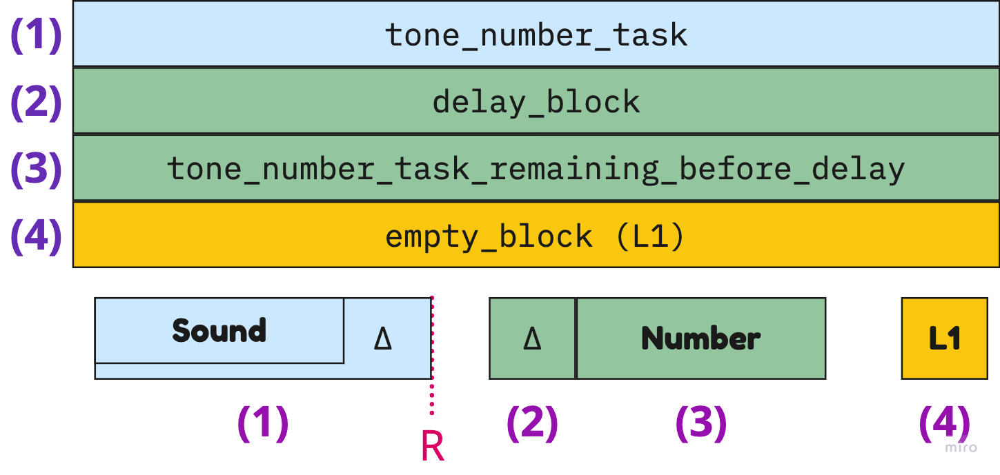
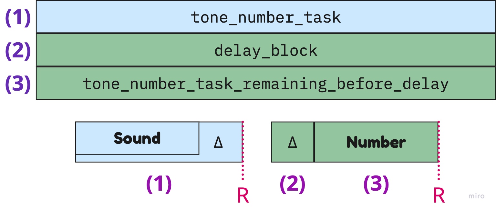

## Especificación de `normalize_data.py`

Cada tarea presenta dos estímulos, separados por un intervalo de tiempo (Δ) que puede tomar valores de {0 ms, 102.5 ms, 992.5 ms, 1025 ms}. El primer estímulo consiste en un tono de 150 ms de duración. Los participantes deben indicar si el tono es de frecuencia baja (440 Hz) presionando la tecla 'A' o si es de frecuencia alta (880 Hz) presionando la tecla 'S'. Luego, se muestra el segundo estímulo, que es un número en pantalla, con un valor comprendido entre 21 y 69, durante 150 ms. Los participantes deben responder si el número es menor que 45 presionando la tecla 'J' o si es mayor que 45 presionando la tecla 'K'.

Los bloques vacíos no contienen ningún estímulo visual o auditivo; en su lugar, registran la respuesta del participante.

La implementación de cada tarea se lleva a cabo en **cuatro escenarios diferentes**, dependiendo de cuándo responde el participante:

**Escenario 1:** En este escenario, ambos estímulos se exponen, separados por el intervalo de tiempo (Δ), y el participante no responde antes de que termine de mostrarse el número. En este caso, se activan dos bloques vacíos (L_1 y L_2) que permanecen activos durante 1200 ms o hasta que el participante presione alguna tecla. Es importante destacar que el participante puede no presionar ninguna tecla durante toda la tarea, y la misma finalizará después de completar los tiempos de exposición de ambos bloques vacíos.

- $RT_1$ representa el tiempo de respuesta de la tarea sonora, calculado como la suma de la duración del tono $(|\text{Sound}| = 150ms)$, el intervalo de tiempo ($\Delta$), la duración del número $(|\text{Number}| = 150ms)$ y el tiempo de respuesta del bloque vacío $RT_{L_1}$, medido desde el momento en que el tono comenzó de sonar.
- $RT_2$ se refiere al tiempo de respuesta de la tarea numérica y se calcula como la suma de la duración del número $(|\text{Number}| = 150ms)$, el tiempo de respuesta del bloque vacío $RT_{L_1}$ y el tiempo de respuesta del bloque vacío $RT_{L_2}$, medido desde el momento en que el número comenzó a mostrarse en pantalla.

**Escenario 2:** En este escenario, se muestra el estímulo sonoro y una parte del intervalo de tiempo (Δ), y el participante responde a la tarea del tono antes de que el número comience a exponerse. Luego, se completa la exposición del intervalo de tiempo (Δ) y se muestra el número. Si el participante no responde a la tarea del número antes de que finalice su exposición, se activa un bloque vacío (L_1) que permanece visible durante 1200 ms o hasta que el participante presione alguna tecla.

- $RT_1$ representa el tiempo de respuesta de la tarea sonora, calculado como la suma de la duración del tono $(|\text{Sound}| = 150ms)$ y el intervalo de tiempo ($\Delta$) que fué presentado antes de que el participante presione la tecla correspondiente.
- $RT_2$ se refiere al tiempo de respuesta de la tarea numérica y se calcula como la suma de la duración del número $(|\text{Number}| = 150ms)$ y el tiempo de respuesta del bloque vacío $RT_{L_1}$, medido desde el momento en que el número comenzó a mostrarse en pantalla.

**Escenario 3:** En este escenario, se presenta el estímulo sonoro y una parte del número, separados por el intervalo de tiempo (Δ), y el participante responde a la tarea del tono antes de que el número termine de exponerse. Luego, se completa la exposición del número y se activa un bloque vacío (L_1), que permanece visible durante 1200 ms o hasta que el participante presione alguna tecla.

- $RT_1$ representa el tiempo de respuesta de la tarea sonora, calculado como la suma de la duración del tono $(|\text{Sound}| = 150ms)$, el intervalo de tiempo ($\Delta$) y la duración del número que fué presentado antes de que el participante presione la tecla correspondiente.
- $RT_2$ se refiere al tiempo de respuesta de la tarea numérica y se calcula como la suma de la duración del número $(|\text{Number}| = 150ms)$ y el tiempo de respuesta del bloque vacío $RT_{L_1}$, medido desde el momento en que el número comenzó a mostrarse en pantalla.

**Escenario 4:** En este escenario, se muestra el estímulo sonoro y una parte del intervalo de tiempo (Δ), y el participante responde a la tarea del tono antes de que el número comience a exponerse. Luego, se completa la exposición del intervalo de tiempo y del número. En este caso, el participante responde a la tarea del número antes de que finalice su exposición.

- $RT_1$ representa el tiempo de respuesta de la tarea sonora, calculado como la suma de la duración del tono $(|\text{Sound}| = 150ms)$ y el intervalo de tiempo ($\Delta$) que fué presentado antes de que el participante presione la tecla correspondiente.
- $RT_2$ representa el tiempo de respuesta de la tarea numérica, calculado como la suma del intervalo de tiempo restante ($\Delta$)  y la duración del número que fué presentado antes de que el participante presione la tecla correspondiente.